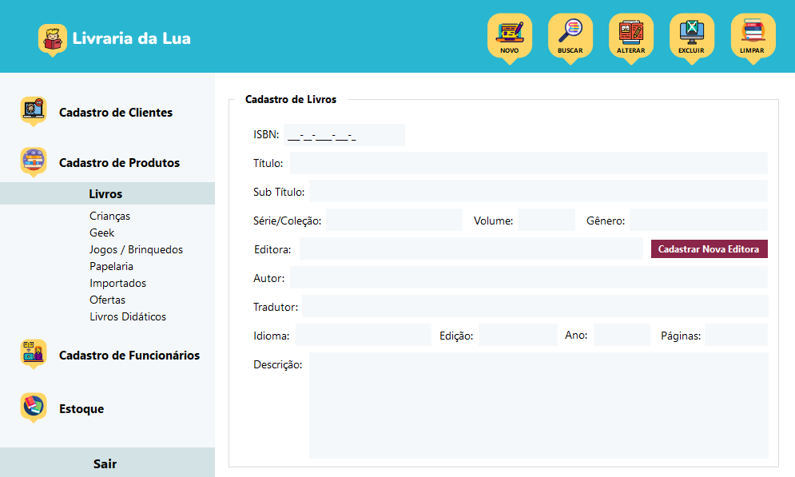

# Aplicativo Livraria – Livraria da Lua

Trabalho: Desenvolver uma aplicação que utilize dos recursos aprendido nas disciplinas de Paradigmas de Programação e Software Design. Descrever os processos 

Sistema produzido em Windows Forms, C# e Utilizando o Banco de Dados SQL Server 

Página de Login
  

Página de abertura
  

Página de Cadastro de Livros
  

